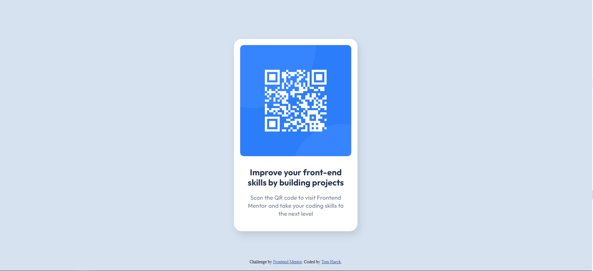

# Frontend Mentor - QR code component solution

This is a solution to the [QR code component challenge on Frontend Mentor](https://www.frontendmentor.io/challenges/qr-code-component-iux_sIO_H). Frontend Mentor challenges help you improve your coding skills by building realistic projects. 

## Table of contents

- [Overview](#overview)
  - [Screenshot](#screenshot)
  - [Links](#links)
- [My process](#my-process)
  - [Built with](#built-with)
  - [What I learned](#what-i-learned)
- [Author](#author)

## Overview

### Screenshot



### Links

- [Solution URL](https://www.frontendmentor.io/solutions/001-qr-code-component-raw-html-and-css-8sFRtpXOFQ)
- [Live Site URL](https://tomhaeck.github.io/frontendmentor.io/001-qr-code-component/)

## My process

### Built with

- HTML
- CSS custom properties
- CSS Flexbox

### What I learned

Vertical centering of the card in the browser window can be done by setting the body's height to `100vh` and 
declaring it a flexbox container.  Flexbox items with `margin: auto` are centered both horizontally and vertically 
within the container.

CSS variables with a global scope can be declared in a pseudo `:root` element.
```css
    :root {
      --white: hsl(0, 0%, 100%);
    }
```

Customization of default CSS values for all elements can be done as follows:
```css
*, *::before, *::after {
  box-sizing: border-box;
  margin: 0;
  padding: 0;
}
```

The figma design file was inspected to check paddings, line heights and word spacings.  Although these
spacing values were adopted in my implementation, there is still a small vertical offset between the 
card text in my implementation vs. the frontendmentor.io solution.

[PixelParallel](https://chromewebstore.google.com/detail/pixelparallel-by-htmlburg/iffnoibnepbcloaaagchjonfplimpkob?pli=1) is a handy Google Chrome extension that allows overlaying the design jpg's onto my implementation 
in the browser window.  It works better than [PerfectPixel](https://chromewebstore.google.com/detail/perfectpixel-by-welldonec/dkaagdgjmgdmbnecmcefdhjekcoceebi),
as the menu pane of the latter causes shifts of the elements in the page, when the page is opened in Developer Mode (F12).

## Author

- Website - [Tom Haeck](https://github.com/tomhaeck)
- Frontend Mentor - [@tomhaeck](https://www.frontendmentor.io/profile/tomhaeck)
