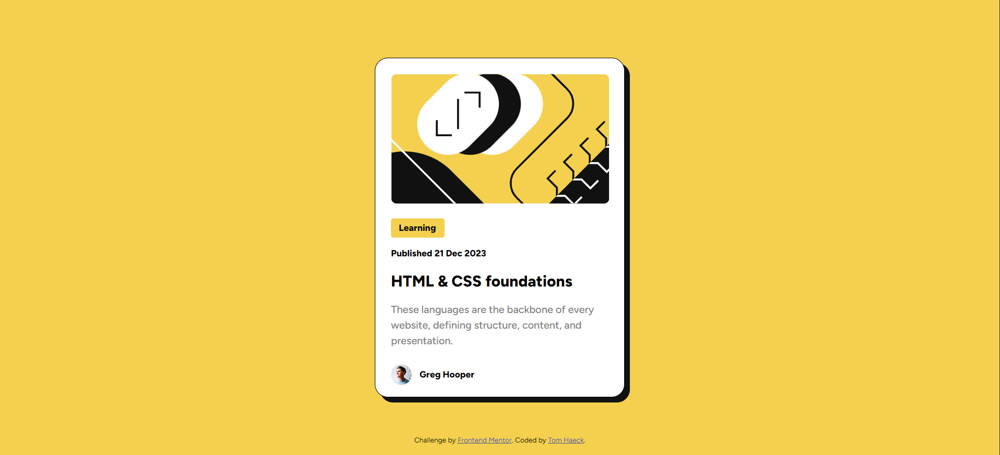

# Frontend Mentor - Blog preview card solution

This is a solution to the [Blog preview card challenge on Frontend Mentor](https://www.frontendmentor.io/challenges/blog-preview-card-ckPaj01IcS). Frontend Mentor challenges help you improve your coding skills by building realistic projects. 

## Table of contents

- [Overview](#overview)
  - [The challenge](#the-challenge)
  - [Screenshot](#screenshot)
  - [Links](#links)
- [My process](#my-process)
  - [Built with](#built-with)
  - [What I learned](#what-i-learned)
  - [Continued development](#continued-development)
  - [Useful resources](#useful-resources)
- [Author](#author)
- [Acknowledgments](#acknowledgments)

## Overview

### The challenge

Users should be able to:

- See hover and focus states for all interactive elements on the page

### Screenshot



### Links

- [Add solution URL here](https://your-solution-url.com)
- [Add live site URL here](https://tomhaeck.github.io/frontendmentor.io/002-blog-preview-card/)

## My process

### Built with

- HTML
- CSS custom properties
- CSS Flexbox

### What I learned

CSS variables can be defined in a pseudo-element `:root` for global scope.

Variable font weights can be included from a file, instead of from Google's CDN.

CSS resetting is important!  E.g. for padding, margin and box-sizing.

Make use of the principle of Cascaded Style Sheets, i.e. define common properties as generally as possible.
For instance, the `font-family` can be defined in the `<body>` element.

It is easy to center a block element both horizontally and vertically in a container using CSS Flexbox.
Define the container as a flex container and set `margin: auto` on the child block element.

There is no need to 'flexbox' everything.  You can also use ad hoc `margin-bottom` to space individual 
items.

Use media queries to define the layout for smaller screens.
```css
@media all and (max-width: 500px) {
    .card {
        width: 327px;
    }
}
```

If you define a CSS width and height for an image, and the aspect ratio of this height and width
does not correspond to the image's aspect ratio, you can force the image to be scaled such that it covers
the full area, using `object-fit: cover`.

Note that the final result is not pixel-perfect with the frontendmentor.io solution.  It is especially hard
to get the vertical spacing between the elements right.   We used the [PixelParallel Chrome extension](https://chromewebstore.google.com/detail/pixelparallel-by-htmlburg/iffnoibnepbcloaaagchjonfplimpkob)
to do the comparison.


## Author

- Website - [Tom Haeck](https://github.com/tomhaeck)
- Frontend Mentor - [@tomhaeck](https://www.frontendmentor.io/profile/tomhaeck)
