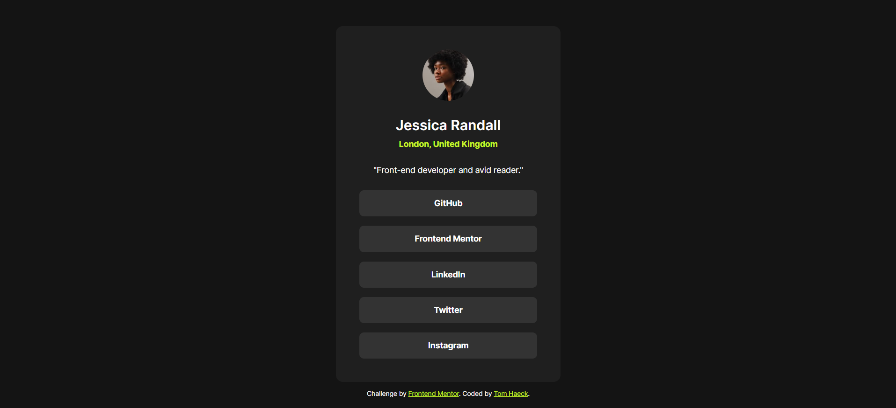

# Frontend Mentor - Social links profile solution

This is a solution to the [Social links profile challenge on Frontend Mentor](https://www.frontendmentor.io/challenges/social-links-profile-UG32l9m6dQ). Frontend Mentor challenges help you improve your coding skills by building realistic projects. 

## Table of contents

- [Overview](#overview)
  - [The challenge](#the-challenge)
  - [Screenshot](#screenshot)
  - [Links](#links)
- [My process](#my-process)
  - [Built with](#built-with)
  - [What I learned](#what-i-learned)
- [Author](#author)

## Overview

### The challenge

Users should be able to:

- See hover and focus states for all interactive elements on the page

### Screenshot



### Links

- [Solution URL](#)
- [Live site URL](https://tomhaeck.github.io/frontendmentor.io/003-social-links-profile)

## My process

### Built with

- HTML
- CSS custom properties
- CSS Flexbox

### What I learned

CSS variables can be globally scoped by declaring them in the pseudo-element `:root`.

Do not forget to do a CSS reset for `border-box`, `padding` and `margin`.
```css
*, *:before, *:after {
  box-sizing: border-box;
  padding: 0;
  margin: 0;
}
```

Declare CSS properties that are identical for all elements in the `body` element.
E.g. `font-family`, `font-size`, etc.  This is the principle of *Cascaded* Style Sheets,
where properties are declared as generally as possible, and are tweaked/overridden for 
more specific elements if needed.

Content of a `div` element can be vertically aligned using either CSS Flexbox or CSS Grid.
Using CSS Flexbox, the centering can be declared either in the parent container or in the 
child items.
```css
/* CSS Flexbox, centering declared in the child items. */
.container {
  display: flex;
}
.child {
  margin: auto;
}

/* CSS Flexbox, centering declared in the parent container  */
.container {
  display: flex;
  
  justify-content: center;
  align-items: center;
}
```

We use the Figma design file to specify the absolute width and height of elements, margins and paddings.
Vertical spacing between elements can be specified ad hoc using e.g. `margin-bottom` on specific items,
or by using e.g. `row-gap` on a flex container.

Media queries are used to change the absolute width and height, as well as the padding, 
of the card for mobile screens.  The media query's breakpoint is chosen arbitrarily.
```css
  @media all and (max-width: 500px) {
    .card {
      width: 327px;
      height: 579px;
      padding: 24px;
    }
  }
```

## Author

- Website - [Add your name here](https://github.com/tomhaeck/)
- Frontend Mentor - [@tomhaeck](https://www.frontendmentor.io/profile/tomhaeck)
