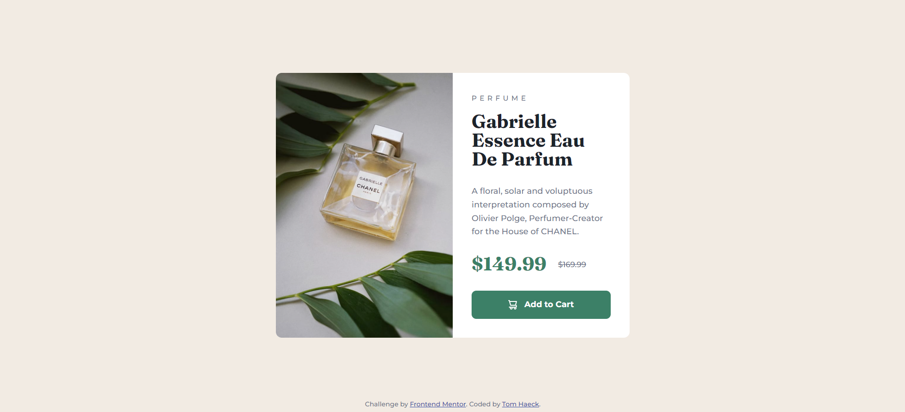

# Frontend Mentor - Product preview card component solution

This is a solution to the [Product preview card component challenge on Frontend Mentor](https://www.frontendmentor.io/challenges/product-preview-card-component-GO7UmttRfa). Frontend Mentor challenges help you improve your coding skills by building realistic projects. 

## Table of contents

- [Overview](#overview)
  - [The challenge](#the-challenge)
  - [Screenshot](#screenshot)
  - [Links](#links)
- [My process](#my-process)
  - [Built with](#built-with)
  - [What I learned](#what-i-learned)
- [Author](#author)

## Overview

### The challenge

Users should be able to:

- View the optimal layout depending on their device's screen size
- See hover and focus states for interactive elements

### Screenshot



### Links

- [Solution URL](https://your-solution-url.com)
- [Live Site URL](https://tomhaeck.github.io/frontendmentor.io/005-product-preview-card-component/)

## My process

### Built with

- HTML
- CSS custom properties
- CSS Flexbox

### What I learned

When using Google fonts, you only need to import the Google font URL to have the
`font-family` name available.   Importing the font URL returns a stylesheet that has declared
the `font-family` name for you.  This is in contrast to when you want to import a local font file (e.g. `.ttf`) yourself.  
```css
/* Google font URL */
@import url("https://fonts.googleapis.com/css2?family=Montserrat:ital,wght@0,100..900;1,100..900&display=swap");

p {
  font-family: Montserrat, sans-serif;
}

/* local font file */
@font-face {
  font-family: whatever-name;
  src: url("assets/fonts/local-file.ttf");
}

p {
  font-family: whatever-name, sans-serif;
}
```

CSS variables can be scoped globally by declaring them in a `:root` pseudo-element.

Do not forget to do a CSS reset for cross-browser compatibility.  `::before` and
`::after` are pseudo-elements, as compared to `:root` which is a pseudo-class.
```css
*, *::before, *::after {
  box-sizing: border-box;
  padding: 0;
  margin: 0;
}
```

The font properties that are generally used in your document should be declared as 
generally as possible, i.e. in the `<body>` element.

Line height in percentage is the line height in pixels divided by the current font-size.

To center the product card in the `<body>` element, the `<body>` element is declared
a CSS flexbox.  There are then two ways to center the card within.
```css
/* declaration of centering on the child element */
body {
  height: 100vh;
  display: flex;
}

.card {
  margin: auto;
}

/* declaration of centering on the parent element */
body {
  height: 100vh;
  display: flex;
  justify-content: center;
  align-items: center; 
}

.card {
}
```

For an `` element, if you set either one of the CSS width or height to a fixed width,
and the other one is set to `auto`, then the aspect ratio of the image is preserved.
When both the CSS width and height are fixed, use `object-fit: cover` to make sure that the
aspect ratio of the image is preserved and that it covers the full area.

Note that when spacing the items in the product info flexbox using 
`justify-content: space-between`, there is a small misalignment between our solution 
and the desktop design's jpg.  This is solved by adding an ad hoc 
`margin-top: -16px` between product subtitle and product title.

We use two different ways to vertically align inline elements with respect to one another:
```css
.product-price-original {
  vertical-align: super;
}

/* vs */

.product-add-to-cart {
  display: flex;
  align-items: center;
}
```

Media queries are used to change the layout of the product card for mobile screens, e.g.
```css
@media all and (max-width: 500px) {
    .product {
        flex-direction: column;
    }
}
```

Note that the `src` attribute of an `` element can be changed dynamically using CSS:
```css
.product-image img {
  content: url("...");
}
```

The `.attribution` element is positioned absolutely with respect to the `<body>` element, using
`position: absolute` and `bottom: 0`.

## Author

- Website - [Tom Haeck](https://github.com/tomhaeck)
- Frontend Mentor - [@tomhaeck](https://www.frontendmentor.io/profile/tomhaeck)
